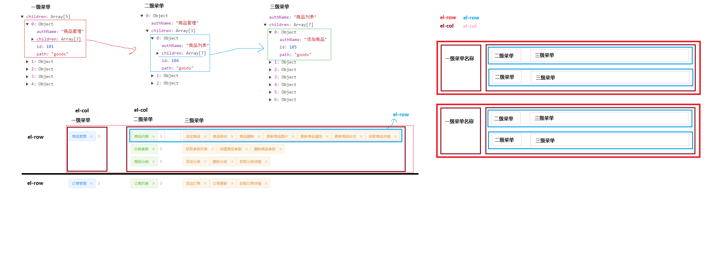

项目功能

- 1 登录(将登录成功的标识（token）存储到localStorage中)
- 2 首页
- 2.1 封装axios
- 3 退出(清除token)
- 4 用户管理
  - 4.1 列表展示
  - 4.2 分页
  - 4.3 查询
  - 4.4 启用/禁用用户
  - 4.5 添加用户
  - 4.6 编辑用户
  - 4.7 删除用户
- 5 权限管理


## 在项目中使用 element-ui


## 1 登录功能
1.利用element-ui中的表单验证功能验证是否符合登陆规则 :rules="rules" ref="ruleForm" 
2.使用 axios 根据接口文档来发送请求，完成登录
2.this.$router.push('/home')
3.将登录成功的标识（token）存储到localStorage中

## 1.2 登录拦截
- 说明：在没有登录的情况不应该让用户来访问除登录以外的任何页面
### 登录和拦截的整个流程说明

- 1 在登录成功以后，将 token 存储到 localStorage 中
- 2 在 导航守卫 中先判断当前访问的页面是不是登录页面
- 3 如果是登录页面，直接放行（next()）
- 4 如果不是登录页面，就从 localStorage 中获取 token，判断有没有登录
- 5 如果登录了，直接放行（next()）
- 6 如果没有登录，就跳转到登录页面让用户登录（next('/login')）


## 2 home主页功能
1.利用element-ui设置容器布局，侧边栏的菜单列表
2.退出功能,清除localStorage的token,跳回登陆页面
## 3. 封装axios
- 3.1  将 axios 添加到Vue的原型中
        Vue.prototype.$http = axios
- 3.2   配置公共路径
axios.defaults.baseURL = 'http://localhost:8888/api/private/v1'
- 3.3   请求拦截器
- 判断如果不是登录接口,就需要添加 Authorization 请求头
 - 响应拦截器有返回的数据，这时候我们可以判断token 是否正确，如果不正确返回登陆界面


## 用户管理
1.利用element-ui设置表格和布局
## 2.分页功能
## 3.启用或禁用用户

### 打开添加用户对话框的步骤

- 1 给添加用户按钮绑定单击事件，事件中让控制对话框展示的数据为 true
- 2 在 dialog 对话框中添加一个 form 表单
  - form 表单的数据（userAddForm）
  - form 表单的验证规则（userAddRules）， :rules="userAddRules" ref="userAddForm"
  
- 3 点击用户添加对话框中的确定按钮，进行表单验证（this.$refs.userAddForm.validate...）
- 4 点击取消按钮，重置表单内容（this.$refs.userAddForm.resetFields()

### 在验证成功中添加用户
- 1 添加用户失败
        1.1 //添加用户成功后应该跳出对话框
         1.2 重新获取列表数据渲染页面
         （ 求当前最大的页码,并跳转，  this.total++， this.current = Math.ceil(this.total / this.pageSize)）
- 2 添加用户失败（用户名已被占用）弹框显示处理

### 删除用户
-1.把当前用户的id为scope.row.id参数传进入，调接口
-2.后台删除成功后，重新渲染页面（并判断当前是不是最后一页(this.userlist.length === 1)，如果是那就要this.current--）

### 编辑用户
### 打开编辑用户对话框的步骤
### 1.展示编辑用户对话框事件
        - 1.1 将控制对话框展示的数据设置为 true
        - 1.2 获取到当前用户数据，并展示在对话框中
          一丶scope.row 作为参数传进去（scope.row 展示的当前用户的数据 ）
          二丶循环遍历编辑用户对话框的当前空的userEditForm ，把当前用户信息curUserdata赋值进去后展示

### 2.编辑用户对话框确定事件
        - 1.2 验证成功才发送axios编辑请求
         - 1.3 判断是否请求成功
         -1.4 请求成功后，以传进来的参数id，用find方法找出当前页userlist的对象
         -1.5，找出当前编辑对象后，把之前已经赋值有数据的userEditForm 分别赋值进去


<hr>

### 权限管理

###  - 1.1 权限列表展示
- 1.2 自定义按钮或者自定义内容要加 template slot-scope="scope" 可以判断等级

###  - 2 权限列表展示 

### 删除用户
  - 1.1 删除角色信息(需要传值)，要用到template slot-scope="scope"
        二 找到索引值后，this.rolesList.splice(curindex, 1)

### 编辑用户
  - 1.2 编辑用户数据，并展示在对话框中
          一丶scope.row 作为参数传进去（scope.row 展示的当前用户的数据 ）
          二丶循环遍历编辑用户对话框的当前curRolesform ，把当前用户信息scope.row的key赋值进去后展示

- 1.3 点击确定编辑用户数据，从列表中渲染
        一。根据传进来的ID找到当前项，并把请求到数据 赋值进去

### 展示角色权限小图标


### 删除权限小图标
        -1.需要角色ID和权限ID。角色ID是每个客户独有的
        -2.把需要的角色ID和权限ID传进去，小图标绑定的事件@close="delRightsByID(scope.row.id,level2.id)"
        -3.请求结果成功后重新渲染页面，根据用户独有的ID找到当前被删除权限的用户出来，把后台数据赋值给他，重新渲染页面

### 树形数据权限对话框

- 1 进入对话框前，就先获取到所有的权限的树形数据，赋值于rightsTree
- 2 对话框弹出来后，this.dialogFormRights = true就会直接所有树形数据

### 当前角色拥有的权限据渲染权限树形

### 思路：
 - 1. setCheckedKeys是通过 keys 设置目前勾选的节点,参数为数组（当前权限id），而且模板要ref="tree" 
        - 2.  用三级菜单权限就可以控制一二级选中状态，就可以直接操作三级菜单权限id
        - 3. 三级菜单权限id可以点击点击展开“分配权限”按钮时候传入来后，三层循环遍历得到

### 步骤
  -              - 1.在点击展开“分配权限”按钮时候，传入当前的当前第一级菜单的里权限数据 scope.row.childrens
   -              - 2.循环遍历传进来的第一级菜单数据，得到三级菜单的权限ID
  -                - 3. setCheckedKeys参数传入三级菜单的权限ID数组就可以


 ### 注意：
 -               因为对话框之前 dialog 一开始是隐藏的。当对话话框展示出来，Vue中的DOM更新
 -       是异步的，数据已经更新，但是dom还没更新，
  -    当 nextTick 的回调函数执行的时候，DOM就已经完成更新了，就可以获取到 this.$refs.tree


### 给角色分配权限后点击确定，渲染页面

### 思路：
- 1.后台接口需要两个参数当前用户ID :curRoleId ,当前被选中的权限的 rids
- 2.当前用户ID :curRoleId 可以通过上一次点击“分配权限按钮”传入参数获取到存在data中
- 3.当前被选中的权限的 rids 要用his.$refs.tree.getCheckedKeys()和this.$refs.tree.getHalfCheckedKeys()

 ### 注意：rids   是要将全选的和半选的合并到一起


 ### 回到用户界面，给当前用户分配权限

 ### 一.打开分配权限对话框时候
- 1.定义多选框绑定的对象Rightsform ，然后传入row的当前的id，username传进去渲染
- 2.根据id获取到角色rid,从而才能操作多选框的内容双向绑定（ <el-select v-model="Rightsform.rid">）
- 3.后台根据id请求到获取到角色rid，把rid赋值给多选框绑定的对象Rightsform.rid

### 一.点击确定分配权限
- 1. 通过Rightsform.rid有没有值，如果没有给分配权限点确定话提醒
- 2.给当前用户分配好权限返回给后台数据并刷新页面

#### 左侧菜单动态显示
- 1.请求后台获取到左侧的菜单数据，在data中提供menuList数据存储
- 2.利用v-for把菜单数据显示到页面中
- 3.处理子菜单的index跳转路径:index="'/home/'+item.path"  和 :default-active="$route.path"（都需要绑定数据）

####  商品分类-列表渲染
- 1.Loading加载
- 2.引入插件el-table-tree-column,可以分类的展开功能 
（安装：npm install element-tree-grid）(注册为局部组件)

# 商品分类-添加分类
- 1.显示有验证规则rules的对话框

- 2.对话框中加入[级联选择器]

- 3.后台数据 赋值给[级联选择器] options数据 （注：返回的数据的格式与级联选择器需要的数据格式不一样， 需要配置 :prop = 'props'）

  ```js
  - props: {
  - value: 'cat_id',
  - label: 'cat_name',
  - children: 'children'
  - }
  ```

  ## 商品分类-添加的功能确定功能

  - 1.给确定注册点击事件

  - 2.给表单做校验

  - 3.发送ajax请求，获取到ajax请求需要的参数

  - 4.如果成功了
    4.1 关闭对话框
     4.2 清除提示信息
     4.3 重新渲染列表
     4.4 给一个提示信息

  - 5.如果失败了，直接给一个提示信息

    

   - 注意：ajax请求需要参数`cat_pid ，cat_name ，cat_level

   - 次级多选框可以参照多选框一样v-model绑定属性

     ~~~js
     ·<el-cascader
                  v-model="addForm.cat_pid"
     //
     > </el-cascader>
     //可以得到出三个参数的值
      cat_pid: cat_pid[cat_pid.length - 1] || 0,
         cat_name,
         cat_level: cat_pid.length
     ~~~

     - 表单重置需要跟绑定prop,  this.$refs.goodsfrom.resetFields()

     ~~~js
     <el-form-item label="父级名称" label-width="120px" prop="cat_pid">
     ~~~

 ### 商品分类-删除功能
 - 1. 给删除按钮注册点击事件（把id传过去）
 - 2. 给一个确认框，是否要删除
 - 3. 发送ajax请求，进行删除即可
 - 4. 成功
4.1 重新渲染（判断最后一页问题）
4.2 提示内容

### 商品管理-列表的展示功能
- 商品信息的展示
- 分页的功能（需要自定义从1到400索引，需要绑定:index）
- 时间的过滤功能 （全局）要安装 cnpm i moment

### 商品管理-准备添加商品的组件
  ~~~js
 :default-active="$route.path.slice(1).split('-')[0]"
~~~

### 商品管理-使用了步骤条组件和tabs组件
- 1. 步骤条组件
 ~~~html
        <el-steps :active="active" finish-status="success">
~~~
- 2. tabs组件
 ~~~html
    <el-tabs >
      <el-tab-pane label="基本信息">基本信息</el-tab-pane>
    </el-tabs>
 ~~~   
- 3. 商品管理-tabs组件和步骤条组件联动 
~~~html
        this.active = +tab.index
  ~~~  
- 4. 添加商品的基本信息el-form组件和el-cascader次级选择器

#### 商品管理-下一步功能
~~~html
<el-tabs
      v-model="activeName"
    >
 ~~~  
 给tabs的每一子项el-tab-pane都执行要给name属性

 #### 商品管理-图片上传
 - el-upload组件
 - action：指定图片上传的地址 
 - headers:设置token 

 - 在成功的时候， handlerSucess需要把上传成功的图片存储到 form中pics中，因为添加商品的时候需要使用

 ### 商品管理-富文本编辑器的使用
 - vue-quill-editor
 - 安装 npm install vue-quill-editor

